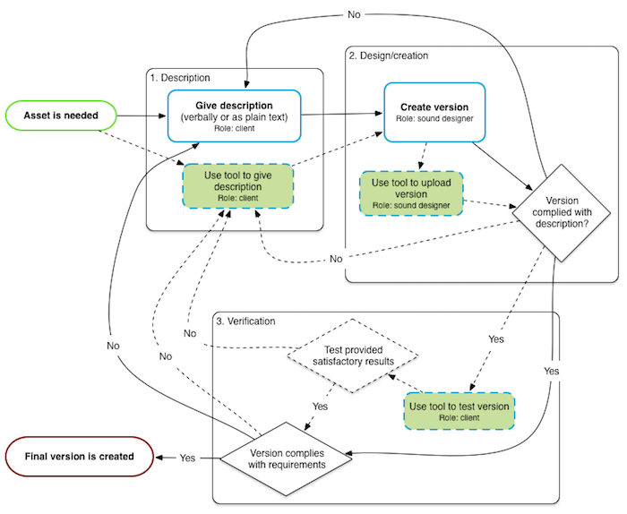
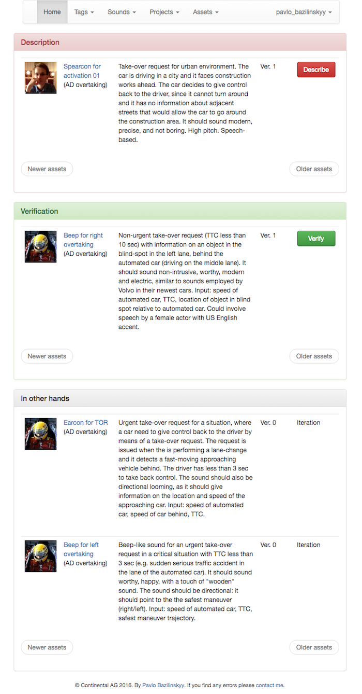

# wordsforsound
This application is meant to support the process of creation/design of auditory assets. The traditional approach in making such assets is following and unstructured and undocumented process of communication between persons that need the sound to be made and persons that design/create the sound. This solution offers the iterative workflow supported by tags and tagged audible examples of auditory assets and sounds.

## Paper
A preprint of a paper describing the tool may be found at:
> Bazilinskyy, P., Cieler, S., & De Winter, J. C. F. (2018). Sound design process for automotive industry. Under review. https://www.researchgate.net/publication/325846614_Sound_design_process_for_the_automotive_industry

## Installation
Whith pip install virtual environment in the project folder: 
```
pip install virtualenv
```

Then install [flask](http://flask.pocoo.org/ "flask") framework in the folder:

```
virtualenv flask
```

If you are on Linux, OS X or Cygwin, install flask and extensions by entering the following commands, one after another:

```
$ flask/bin/pip install -r requirements.txt
```

If you are on Windows the commands are slightly different:

```
$ flask\Scripts\pip.exe install -r requirements.txt
```

Then, a database needs to be initialised:

```
$ flask/bin/python db_create.py
```

On Windows:

```
$ flask\Scripts\python.exe db_create.py
```

## Running
To run the application, after initial setup as explained in the section above, simply run the command (on Unix-based system):

```
$ flask/bin/python run.py
```

Or on Windows:

```
$ flask\Scripts\pyhton.exe run.py
```

After the server initializes it will listen on port 5000 waiting for connections:

```
http://localhost:5000
```

## Configuration
Parameters of the application can be adjusted in the file `config.py`. Families of sounds can be managed in `sound_families.py`. Types of sounds can be managed in `sound_types.py`.

## Use
Unless a user was provided with an account for the application, user must register to use the application at `register`. All views in the application can be views by logged in users only. Users can be of two types: `clients` and `suppliers`:

* **Clients** are those participants in the process that need auditory assets to be be designed, i.e. they describe such assets and ask suppliers to make them. Clients then also verify if provided iterations of needed assets satisfy requirements and needs of the clients.

* **Suppliers** are those participants in the process that design auditory assets based on initial and updated descriptions received from the clients. 

#### Workflow
Sound creation with use of the application follows a cycle `description` -> `iteration` -> `verification`. Users participating in the creation process can be notified by email when they need to take action for a particular asset.

In order to create an asset one needs to add a project at `add_project`. After a new project has been added the user can add assets to the project at `add_asset`.

#### Homepage
After logging in the user it redirected to the home page at `index`. This page contains a list of active assets, which are in one of three stages of the workflow `description`, `iteration`, `verification`, refer to Fig. 1 below. If an asset that the user is working on is not "in hands" of the user, i.e. another user needs to send the asset further along the workflow process, the asset is shown in the list `In other hands`.


<p align="center">Figure 1. Sound design process.</p>

Please refer to Fig. 2 for an example of the homepage as seen by a client that requests four assets to be made: 1) The asset **Spearcon for activation 01** requires a new descriptions, since the iteration of version 1 was not accepted as final; 2) The asset **Beep for right overtaking** needs to be verified, because the supplier working on the asset provided the first iteration; 3-4) The assets **Earcon for TOR** abd **Beep for left overtaking** are **In other hands**, meaning that the client, who's homepage you may see on the figure, does not have to take any actions for the assets in question at the moment, i.e. in this case these two assets need to be supplied with iterations by assigned suppliers.


<p align="center">Figure 2. Example of homepage of client.</p>

The horizontal menu contains the search input field. The input becomes hidden on small window sizes.

#### Projects
New projects can be added at `add_project`. Project cannot be deleted.

#### Assets
New asset can be added at `add_asset`. Assets cannot be deleted, but they can be marked as finished at the verification stage. In the asset creation page, a client can specify pitch, which take any input (e.g. "A#"). It is also possible to specify duration of the asset, which take any input (e.g. "~250 ms").

Each asset must be assigned to at least one client and at least one supplier. Corresponding users must be selected from multiple choice selection boxes at the state of creation of the asset description in `add_asset`.

#### Tags
The database contains tags, which can be used for descriptions of assets and tagging sounds. A list of all tags is available at `tags`. These are all tags that were added by users of the system. New tag can be added at `add_tag`. Tags can be deleted at `delete_tag`.

Also preset tags can be added to the database. The urgency is represented by four tags: `urgent-1`, `urgent-2`, `urgent-3`, and `urgent-4`. These tags represent the scale of urgentness, with `urgent-1` being least urgent and `urgent-4` being most urgent.

#### Sounds
The database contains sounds, which serve as examples for description of assets. A list of all sounds is available at `sounds`. These are all sounds that were added by users of the system. New sound can be added at `add_sound`. Sounds can be tagged with tags in the database. Each sound must be in one of sound families and it need to be of one of sound types. Sounds can be deleted at `delete_sound`.
